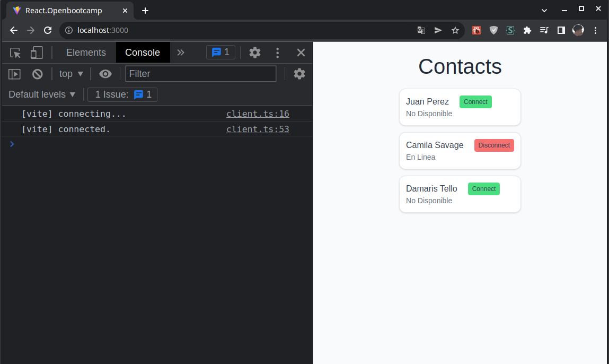

## INICIAR LA APLICACION
#### STEP 1: Clonar el repositorio
`$ git clone https://github.com/lemcok/openbootcamp-react.git`
#### STEP 2: Entrar en la carpeta del projecto e instalar las dependencias
`$ cd openbootcamp-react && npm install`
#### STEP 3: Ejecutar el npm script
`$ npm run dev`
#### STEP 4: Comprobar en el navegador http://localhost:3000
